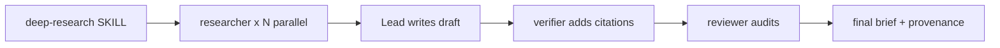

# qnet-awesome

A Claude Code plugin that bundles a multi-agent research pipeline and a code-explanation skill. Everything in this repo is Markdown with YAML frontmatter — the Claude Code harness loads it at session start. There is no build step.

> Status: plugin-in-progress. `.claude-plugin/plugin.json` and `commands/` are not yet populated; agents and skills are usable today when this directory is added as a plugin source.

## What's inside

### Skills (`skills/`)

| Skill | Purpose |
| --- | --- |
| [`deep-research`](skills/deep-research/SKILL.md) | Runs a thorough, source-heavy investigation. Orchestrates parallel researchers, drafts a report, then cites and audits it. Produces a dated deliverable folder with provenance. |
| [`explain-code`](skills/explain-code/SKILL.md) | Explains code with an analogy, a Mermaid diagram, a step-by-step walkthrough, and a gotcha. Saves the explanation as a dated Markdown report. |

### Agents (`agents/`)

| Agent | Role |
| --- | --- |
| [`researcher`](agents/researcher.md) | Gathers primary evidence across web, papers, repos, and docs. Writes an evidence table with verifiable URLs. |
| [`writer`](agents/writer.md) | Turns research notes into a structured draft. Preserves caveats; adds no citations. |
| [`verifier`](agents/verifier.md) | Anchors every factual claim to a source, verifies each URL, and builds the final Sources section. |
| [`reviewer`](agents/reviewer.md) | Acts as a skeptical peer reviewer or adversarial auditor. Produces a structured review with inline annotations. |

## The research pipeline

`deep-research` is the orchestrator. It spawns researchers in parallel, writes the draft itself (deliberately bypassing `writer` to keep evidence traceability tight), then hands off to `verifier` and `reviewer`.



All artifacts for a run live under a dated folder:

```
.claude/resources/docs/deep-research/<yyyy-mm-dd>-<slug>/
├── .plans/<slug>.md
├── .drafts/<slug>-draft.md
└── no-NN-<descriptive-name>.md
```

The zero-padded `no-NN-` prefix on deliverables encodes execution order.

## Design principles

- **URL or it didn't happen.** No source is cited without a direct, checkable URL.
- **Preserve uncertainty.** Inferences are labeled as inferences; contradictions are surfaced, not smoothed.
- **Strict division of labor.** Researchers gather, the lead drafts, the verifier cites, the reviewer audits. No agent does two jobs.
- **File-based handoff.** Subagents write to files and return lightweight references so the parent's context stays small.

## Layout

```
.claude-plugin/      # plugin manifest (TBD)
agents/              # subagent definitions
commands/            # slash commands (TBD)
skills/              # skill definitions
CLAUDE.md            # guidance for Claude Code sessions in this repo
plugins-design.excalidraw   # design sketch (gitignored)
```

See [`CLAUDE.md`](.claude/CLAUDE.md) for editing conventions and invariants the agents rely on.
