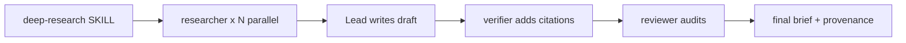

# qengine

A **Claude Code plugin for software engineering** built on the harness engineering model — every component is a Markdown file with YAML frontmatter that the Claude Code harness loads at session start. No build step, no runtime, just structured prompting with strict division of labor.

## Install

Add the marketplace and install the plugin from the GitHub repo:

```shell
/plugin marketplace add phuquocchamp/qengine
/plugin install qengine@qengine
```

Or via the CLI:

```bash
claude plugin marketplace add phuquocchamp/qengine
claude plugin install qengine@qengine
```

## What's inside

### Skills

Skills are invoked with a slash command inside Claude Code.

| Skill                                            | Command                          | Purpose                                                                                                                                                                            |
| ------------------------------------------------ | -------------------------------- | ---------------------------------------------------------------------------------------------------------------------------------------------------------------------------------- |
| [`deep-research`](skills/deep-research/SKILL.md) | `/deep-research <topic>`         | Multi-round source-heavy investigation. Spawns parallel researcher subagents, drafts a full report, adds inline citations, and produces a verified brief with provenance tracking. |
| [`explain-code`](skills/explain-code/SKILL.md)   | `/explain-code <file \| symbol>` | Explains code with an analogy, a Mermaid diagram, a step-by-step walkthrough, and a gotcha. Saves the explanation as a dated Markdown file.                                        |

### Agents

Subagents used by the research pipeline. They do not invoke each other — only the `deep-research` skill orchestrates them.

| Agent                                | Role                                                                                                            |
| ------------------------------------ | --------------------------------------------------------------------------------------------------------------- |
| [`researcher`](agents/researcher.md) | Gathers primary evidence across web, papers, repos, and docs. Writes an evidence table with verifiable URLs.    |
| [`writer`](agents/writer.md)         | Turns research notes into a structured draft. Preserves caveats; adds no citations.                             |
| [`verifier`](agents/verifier.md)     | Anchors every factual claim to a source, verifies each URL, and builds the final Sources section.               |
| [`reviewer`](agents/reviewer.md)     | Acts as a skeptical peer reviewer or adversarial auditor. Produces a structured review with inline annotations. |

## The research pipeline

`deep-research` is the orchestrator. It fans out to parallel researchers, writes the draft itself (deliberately bypassing `writer` to keep evidence traceability tight), then hands off to `verifier` and `reviewer`.



All artifacts for a run live under a dated folder:

```
./docs/deep-research/<yyyy-mm-dd>-<slug>/
├── .plans/<slug>.md
├── .drafts/<slug>-draft.md
└── no-NN-<descriptive-name>.md
```

The `no-NN-` zero-padded prefix encodes execution order across researcher rounds and post-processing steps.

## Design principles

- **Harness engineering model.** All behavior is defined in Markdown with YAML frontmatter. The Claude Code harness is the runtime — no external dependencies.
- **URL or it didn't happen.** No source is cited without a direct, checkable URL.
- **Preserve uncertainty.** Inferences are labeled as inferences; contradictions are surfaced, not smoothed.
- **Strict division of labor.** Researchers gather, the lead drafts, the verifier cites, the reviewer audits. No agent does two jobs.
- **File-based handoff.** Subagents write to files and return lightweight references so the parent's context stays small.

## Layout

```
.claude-plugin/      # plugin manifest and marketplace catalog
agents/              # subagent definitions
skills/              # skill definitions
  deep-research/     # multi-agent research orchestrator
  explain-code/      # code explanation with diagrams
CLAUDE.md            # editing conventions and invariants
```

## Requirements

- Claude Code CLI or desktop app
- Claude Max or API subscription (the `deep-research` skill runs on Opus by default)
